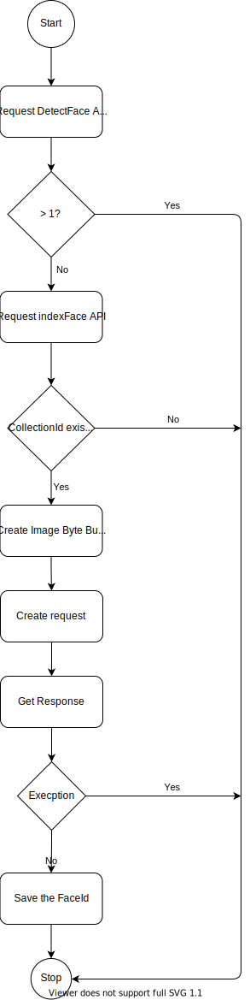
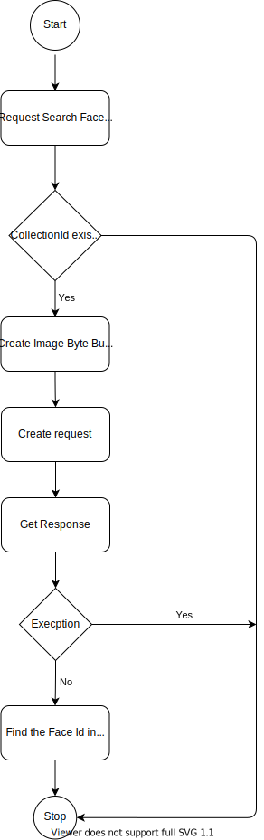

# Amazon Rekognition

## Cài đặt

1. Đăng ký tài khoản Amazon
    - Truy cập vào trang đăng ký tài khoản [tại đây](https://portal.aws.amazon.com/billing/signup#/).
    - Điền các thông tin như:
      - Họ và tên
      - Email
      - Mật khẩu
      - Thông tin thanh toán (Hệ thống sẽ tự động tính phí 1 USD cho lần đăng ký đầu tiên)
    - Sau khi hoàn tất các thông tin bắt buộc, Amazon sẽ tiến hành xác thực tài khoản.

2. Tạo tài khoản IAM
    - Các dịch vụ trong hệ thống AWS đều yêu cầu người dùng cung cấp một chứng chỉ trước khi sử dụng. Thông qua các chứng chỉ này, AWS có thể xác định được các quyền truy cập vào tài nguyên của các dịch vụ tương ứng. Việc tạo các chứng chỉ này có thể thực hiện bằng ```AWS CLI``` hoặc sử dụng các ```API``` liên quan.
    - Các bước để khởi tạo tài khoản ```IAM``` với quyền quản trị:
        1. Đăng nhập vào trang [IAM console](https://console.aws.amazon.com/iam/) với quyền Root.
        2. Kích hoạt quyền truy cập vào các thông tin thanh toán cho tài khoản ```IAM admin```
           - Tại thanh ```Navigation```, click vào ```Tên tài khoản``` và chọn ```My Account```
           - Chọn ```Edit``` tại phần ```IAM User and Role Access to Billing Information``` (Chỉ có tài khoản ```root``` mới có quyền thực hiện thao tác này).
           - Tích chọn ô ```Activate IAM Access``` sau đó chọn ```Update```
           - Chọn ```Services``` > ```IAM``` tại thanh ```Navigation``` để trở về trang ```IAM console```.

        3. Tại bảng điều khiển, chọn ```User``` > ```Add users```.

        4. Tại trang ```Detail```
           - Điền **Administrator** vào trường ```User Name```
           - Tích chọn ô ```AWS Management Console access```, chọn ```Custom password``` sau đó nhập mật khẩu mới của bạn
           - Theo mặc định, AWS sẽ yêu cầu người dùng mới đổi mật khẩu sau lần đầu tiên đăng nhập. Để bỏ qua yêu cầu này, xoá chọn ô ```User must create a new password at next sign-in```
           - Sau khi đã hoàn tất các bước trên, chọn ```Next: Permissions```
        5. Tại trang ```Permission```
           - Chọn ```Add user to group```
           - Chọn ```Create group```
           - Một hộp thoại mới xuất hiện, điền **Administrators** vào trường ```Group name```
           - Chọn ô ```AdministratorAccess```.
           - Sau khi hoàn tất, chọn nút ```Create group```.
           - Trở lại trang chứa danh sách các nhóm người dùng hiện hữu, tìm và chọn nhóm người dùng bạn vừa tạo (Refresh trang nếu nhóm người dùng bạn vừa tạo không xuất hiện).
           - Chọn ```Next: Tags```
        6. Tại trang Tags, thêm các ```metadata``` cho người dùng bằng cách đính các nhãn là các cặp ```key-value``` (Không bắt buộc).
        7. Chọn ```Next: Review```, xác nhận lại các thông tin về nhóm đã được thêm bởi bạn. Sau khi xác nhận lại các thông tin, chọn ```Create user```.
        8. Tại trang ```Complete```, tải file ```.csv``` chứa các thông tin đăng nhập của người dùng.

3. Cài đặt ```AWS CLI```
    - Chọn phiên bản ```aws cli``` phù hợp và tải xuống [tại đây](https://aws.amazon.com/cli/?nc1=h_ls)
    - Tạo một ```khoá truy cập``` cho tài khoản IAM bạn vừa tạo
        1. Đăng nhập vào trang ```AWS Management Console``` và mở ```IAM console``` [tại đây](https://console.aws.amazon.com/iam/).
        2. Tại khu vực ```navigation``` chọn ```Users```.
        3. Tìm và chọn tên của tài khoản bạn đã tạo, một hộp thoại sẽ xuất hiện trên màn hình.
        4. Chọn tab ```Security credentials```
        5. Chọn ```Create access key```, Sau đó tải file ```.csv``` và lưu vào một khu vực an toàn. Khoá truy cập này sẽ không thể cấp lại sau khi đóng hộp thoại.
        6. Tạo thư mực ```.aws```

            ```bash
            Unix-based:
            cd ~/.aws

            Windows:
            mkdir %HOMEPATH%\.aws
            ```

        7. Trong thư mục ```.aws``` tạo một file ```credentials```.
           - Sao chép các thông tin về khoá (bước 5) vào file ```credentials``` như sau:
  
              ```bash
              [default]
              aws_access_key_id = your_access_key_id
              aws_secret_access_key = your_secret_access_key
              ```

        8. Lưu lại các thông tin vừa thay đổi.
        9. Trong thư mục ```.aws``` tạo một file ```config```
           - Nhập các thông tin về khu vực theo định dạng

            ```bash
            [default]
            region = your_aws_region
            ```

            - Theo mặc định, nếu không khai báo ```region``` thì ```us-east-1``` sẽ được sử dụng.

## Sử dụng SDK (JAVA SDK v2)

1. Cài đặt ```Java``` và ```Apache Maven```
    - Cài đặt Java SDK thông qua các arch:
      - [Oracle Java SE Development Kit](https://www.oracle.com/java/technologies/javase-downloads.html)
      - [Amazon Corretto](http://aws.amazon.com/corretto/)
      - [Red Hat OpenJDK](https://developers.redhat.com/products/openjdk)
      - [AdoptOpenJDK](https://adoptopenjdk.net/)
    - Cài đặt Maven [tại đây](https://maven.apache.org/)
      - Để có thể sử dụng ```Maven``` trên ```PowerShell```, cần chú ý các mục sau:
        - Truy cập vào ```Environment Variables``` của hệ thống, tại bảng ```System variables``` tạo một variable như sau

        ```bash
        MAVEN_HOME = /path/to/maven/root/folder
        ```

        - Thêm variable vào ```PATH``` như sau:

        ```bash
        %MAVEN_HOME%\bin
        ```

2. Cài đặt IDE
    - Các IDE thông dụng hiện nay: ```IntelliJ Utimate IDE```, ```Vs Code (Text-based)```
       - Tải về và cài đặt  ```IntelliJ Utimate IDE``` [tại đây](https://www.jetbrains.com/idea/download)
       - Tải về và cài đặt ```Vs Code``` [tại đây](https://code.visualstudio.com/download)

3. Khởi tạo project
    - Mở ```terminal``` và chuyển đến folder cần khởi tạo project
    - Sử dụng ```maven``` command khởi tạo project có tên ```rekognition```

        ```bash
        Linux-Based
        mvn -B archetype:generate \
            -DarchetypeGroupId=org.apache.maven.archetypes \
            -DgroupId=com.exam.rekognition \
            -DartifactId=rekognition

        Window CMD
        mvn -B archetype:generate \
            -DarchetypeGroupId=org.apache.maven.archetypes \
            -DgroupId=com.exam.rekognition \
            -DartifactId=rekognition

        Window Powershell
        mvn -B archetype:generate \
            "-DarchetypeGroupId=org.apache.maven.archetypes" \
            "-DgroupId=com.exam.rekognition" \
            "-DartifactId=rekognition"
        ```

    - Sau khi chạy câu lệnh trên, project sẽ được khởi tạo, các cấu hình của project sẽ được định nghĩa trong file ```pom.xml```.

    - Cấu hình project với các dependencies cho ```AWS SDK```, ```Amazon s3```, ```Java 1.8``` trong file ```pom.xml``` như sau

        ```xml
        <project xmlns="http://maven.apache.org/POM/4.0.0" xmlns:xsi="http://www.w3.org/2001/XMLSchema-instance" xsi:schemaLocation="http://maven.apache.org/POM/4.0.0 http://maven.apache.org/maven-v4_0_0.xsd">
        <modelVersion>4.0.0</modelVersion>
        <properties>
            <project.build.sourceEncoding>UTF-8</project.build.sourceEncoding>
        </properties>
        <groupId>com.example.myapp</groupId>
        <artifactId>myapp</artifactId>
        <packaging>jar</packaging>
        <version>1.0-SNAPSHOT</version>
        <name>myapp</name>
        <dependencyManagement>
            <dependencies>
                <dependency>
                    <groupId>software.amazon.awssdk</groupId>
                    <artifactId>bom</artifactId>
                    <version>2.17.46</version>
                    <type>pom</type>
                    <scope>import</scope>
                </dependency>
            </dependencies>
        </dependencyManagement>
        <dependencies>
            <dependency>
                <groupId>junit</groupId>
                <artifactId>junit</artifactId>
                <version>3.8.1</version>
                <scope>test</scope>
            </dependency>
            <dependency>
                <groupId>software.amazon.awssdk</groupId>
                <artifactId>s3</artifactId>
            </dependency>
            </dependencies>
        <build>
            <plugins>
                <plugin>
                    <groupId>org.apache.maven.plugins</groupId>
                    <artifactId>maven-compiler-plugin</artifactId>
                    <version>3.8.1</version>
                    <configuration>
                    <source>8</source>
                    <target>8</target>
                    </configuration>
                </plugin>
            </plugins>
        </build>
        </project>
        ```

    - Update maven khi thêm hoặc xoá một dependency bất kỳ

        ```bash
        mvn clean install -U

        -U means force update of snapshot dependencies.
        ```

    - Video sử dụng maven trên ```IntelliJ IDEA``` [tại đây](https://www.youtube.com/watch?v=JhSBS2OpGdU).

## Face Recognition

- Để làm việc với các API Face Recognition, cần khởi tạo một ```FaceCollection```
  - FaceCollection lưu trữ các ```faceId``` sau mỗi lần sử dụng ```indexFace``` API.
  - FaceCollection không lưu trữ bất kỳ ảnh nào do người dùng tải lên.

- Sau khi khởi tạo ```FaceCollection```, người dùng cần thêm các ```Face id``` vào collection này thông qua ```indexFace``` API.
  - Với mỗi ảnh gửi lên, sẽ có một ```Face id``` tương ứng.
  
  - Colletion sẽ không lưu trữ ảnh, chỉ lưu trữ thông tin về ```Face id```, do đó, người dùng cần lưu một ```key``` để đối soát với ```Face id``` do AWS trả về.
  
  - Để đảm bảo tính chính xác, ```indexFace``` API nên được gọi với các ảnh chỉ chứa một khuôn mặt duy nhất. ```DetectFaces``` API nên được sử dụng trước để xác định số lượng khuôn mặt xuất hiện trong ảnh.

- Với mỗi ảnh cần tìm kiếm trong collection, AWS sẽ trả về 2 tập dữ liệu bao gồm:
  - Các ảnh đã được đánh index (có ```Face id```).
  - Các ảnh chưa được đánh index.

1. Luồng indexFace

    

2. Luồng Search Face

    

## Code example

[Github](https://github.com/mtoan2111/aws-rekognition-sample)
